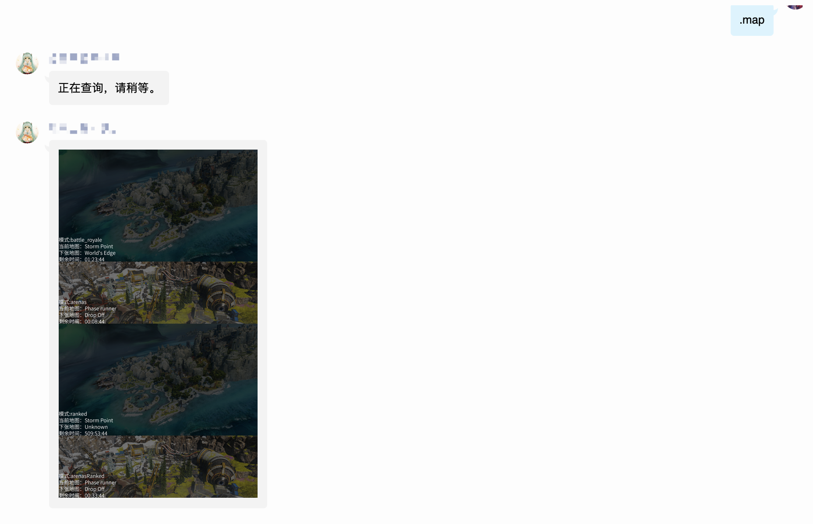
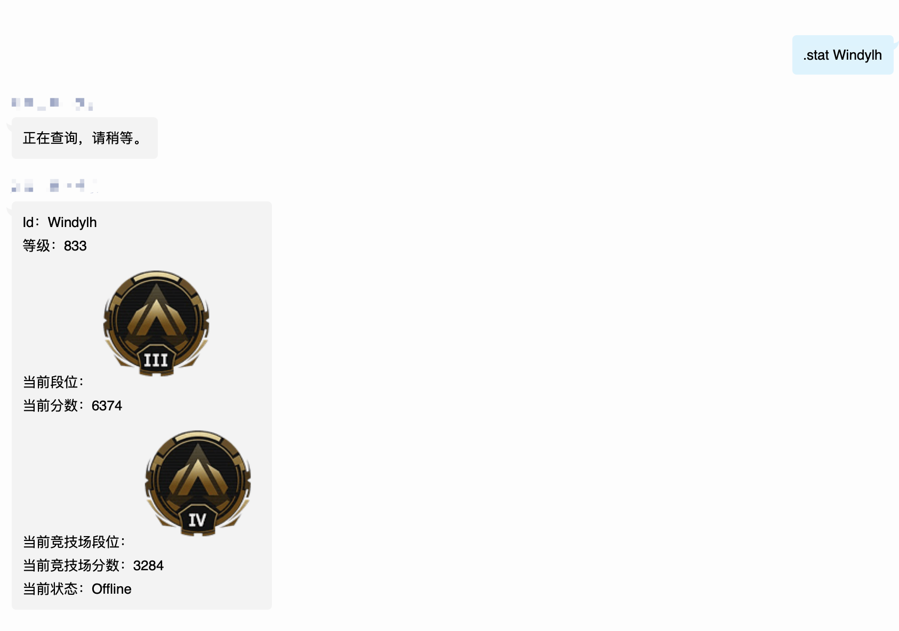
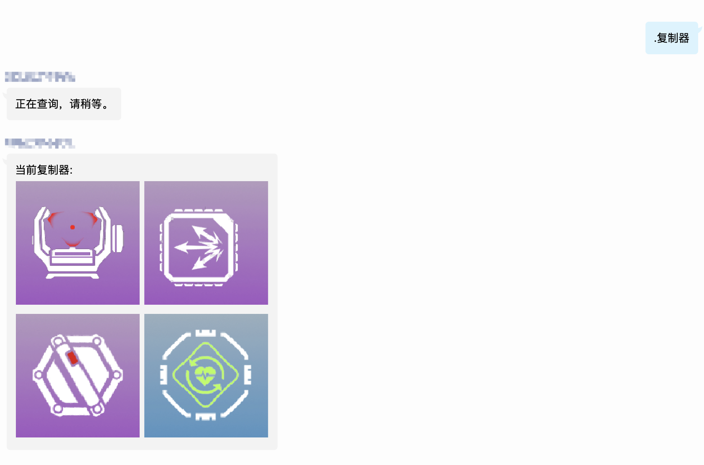
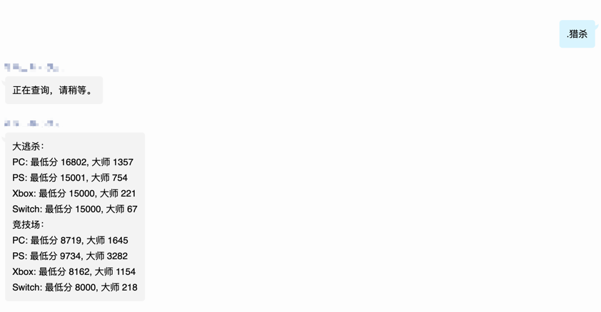

## nonebot_plugin_apexranklookup

一个基于nonebot的插件，用于查询Apex英雄的

> 地图轮换
> 
> 玩家信息
> 
> 复制器
> 
> 猎杀门槛

## api key申请
在https://apexlegendsapi.com/ 获取APIkey填入.env 或者config.py中
`apex_api_token`

## 使用
#### .map/.地图
查看当前大逃杀、竞技场模式轮换地图，以及地图剩余时间。

#### .stat/.查询 origin_id (平台)
根据origin_id查询玩家信息（id、等级、段位、当前状态）

可查询多平台(PC、PS4、X1)，不添加默认PC

#### .crafting/.复制器
查询当前复制器轮换物品。

#### .pd/.猎杀
查询全平台大逃杀、竞技场猎杀最低分和大师段位以上的人数。

#### .bind/.绑定
origin id 与qq绑定，实现更方便的查询。

#### .unbind/.解绑
解除绑定

### 图片自定义
/data/image/base.png 为玩家信息的背景底色，可以660*750大小替换。

/data/font/SourceHanSansCN-Normal.ttf 为默认字体，也可替换，之后去draw.py修改路径。

更多样式修改详见draw.py

## TODO
> 中文文本翻译
> 
> ~~输出美化~~
> 
> ~~追踪器输出优化~~
> 
> ~~添加绑定功能~~
> 
> 添加订阅功能

## 致谢

https://apexlegendsapi.com/

https://github.com/Shennoter/ApexRankLookUp
